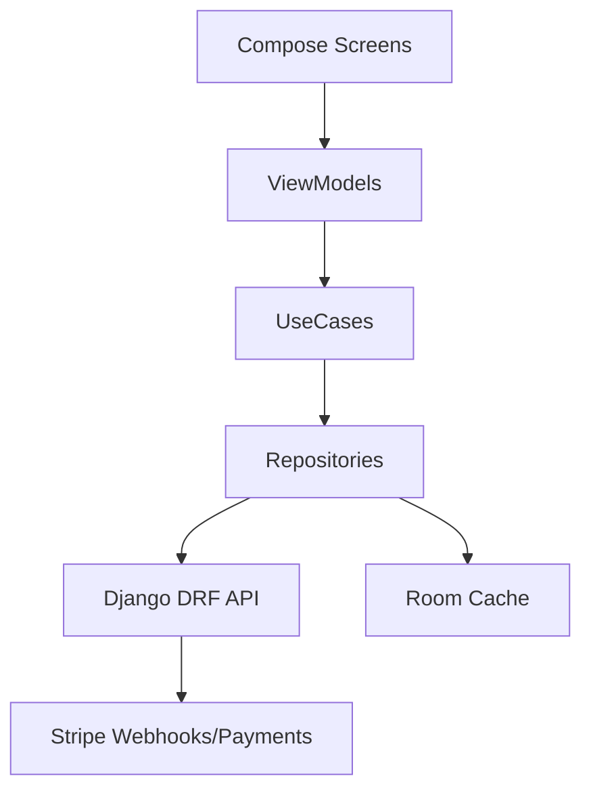
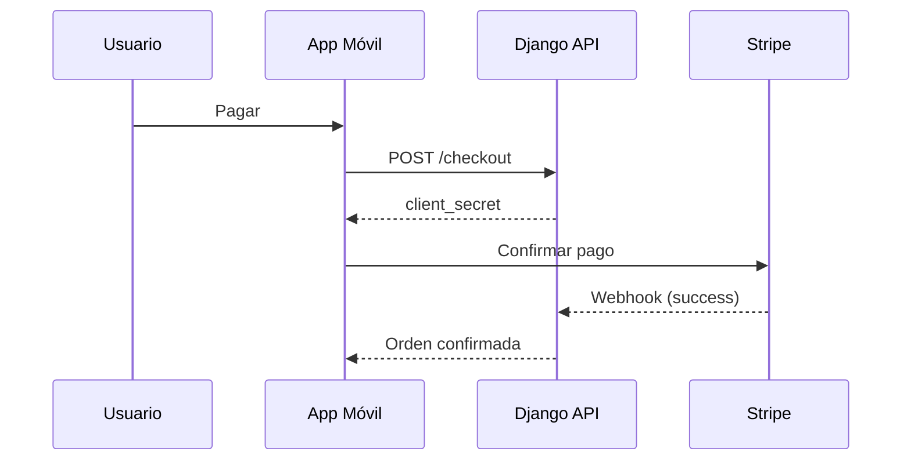

# Plan de Implementación App Móvil — E-commerce (Farmacia Digital) MediCitas

Guía técnica para construir la app Android (Kotlin + Jetpack Compose) del módulo de E-commerce, integrada con la API Django ya planificada.

## 1. Objetivo y alcance
- Venta de servicios y productos farmacéuticos: catálogo, carrito, checkout, órdenes, reembolsos.
- Autenticación por JWT; pagos con Stripe; historial de pedidos.
- MVP Android; iOS futuro a partir de la misma API.

## 2. Arquitectura móvil
- Patrón: Clean Architecture + MVVM + Jetpack Compose.
- Capas: data (network+DB), domain (use cases), presentation (UI/VM).
- Módulos Gradle (ejemplo):
  - :app (navegación, DI, tema)
  - :core:network (Retrofit, OkHttp, AuthInterceptor)
  - :core:database (Room)
  - :feature:catalog, :feature:cart, :feature:checkout, :feature:orders

## 3. Dependencias clave
| Librería | Uso |
|---|---|
| Kotlin + Coroutines/Flow | Concurrencia/reactivo |
| Jetpack Compose + Navigation | UI declarativa |
| Hilt (DI) | Inyección de dependencias |
| Retrofit + OkHttp + Kotlinx Serialization | Cliente HTTP |
| Room | Cache offline (catálogo/carrito) |
| Stripe Android SDK | Confirmación de pagos |
| Jetpack Security (EncryptedSharedPrefs) | Guardar tokens |
| Ktlint + Detekt | Estilo y estática |
| Timber | Logs |
| Coil | Imágenes |

## 4. Configuración del proyecto
- Gradle Kotlin DSL + Version Catalog (libs.versions.toml).
- Build variants: dev/staging/prod (diferentes BASE_URL, Stripe keys públicas).
- Secure Storage: EncryptedSharedPrefs para access/refresh tokens.
- ProGuard/R8: reglas para Retrofit/Stripe.

## 5. Modelado de datos (DTO)
| Entidad | Campos mínimos |
|---|---|
| Product | id, name, description, price, currency, is_active, category |
| Category | id, name, slug |
| Cart | id, userId, items[], total |
| CartItem | id, productId, quantity, unitPrice, subtotal |
| Order | id, status, total, currency, createdAt, items[] |
| OrderItem | id, productId, quantity, unitPrice, subtotal |
| Coupon | code, type, value, validFrom/To |
| PaymentIntentResp | clientSecret, amount, currency |

## 6. API Django (E-commerce)
| Método | Ruta | Descripción | Auth |
|---|---|---|---|
| GET | /api/ecommerce/products/ | Listar productos | Público |
| GET | /api/ecommerce/products/:id/ | Detalle | Público |
| GET | /api/ecommerce/categories/ | Listar categorías | Público |
| GET | /api/ecommerce/cart/ | Carrito actual | JWT |
| POST | /api/ecommerce/cart/items/ | Agregar/actualizar item | JWT |
| DELETE | /api/ecommerce/cart/items/:id/ | Quitar item | JWT |
| POST | /api/ecommerce/coupons/validate/ | Validar cupón | JWT |
| POST | /api/ecommerce/checkout/ | Crear orden + PaymentIntent | JWT |
| GET | /api/ecommerce/orders/ | Historial pedidos | JWT |
| GET | /api/ecommerce/orders/:id/ | Detalle pedido | JWT |
| POST | /api/ecommerce/orders/:id/cancel/ | Cancelación | JWT |

Notas:
- Autorización: Header Authorization: Bearer <token>.
- Totales y cupones se validan en backend.

## 7. Flujos principales
1) Compra: Catálogo → Detalle → Agregar al carrito → Carrito → Cupón → Checkout → Stripe confirm → Orden OK → Email.
2) Reembolso/Cancelación: Solicitud → reglas por estado → Stripe refund → actualizar orden.

## 8. UI/UX (Compose)
- Screens: Catalog, ProductDetail, Cart, Checkout, OrderSuccess, OrdersHistory, Login/Register.
- Componentes: ProductCard, QuantitySelector, CouponField, PriceSummary, PaymentButton.
- Navegación: Navigation Compose con deep-links (orden detalle).
- Accesibilidad: contrastes, TalkBack, tamaños dinámicos.

## 9. Seguridad
- Tokens en EncryptedSharedPrefs; auto-refresh si aplica.
- TLS/HTTPS obligatorio; (opcional) certificate pinning.
- Idempotency-Key en checkout (generada por App, usada por API).
- No CSRF en móvil (solo JWT por header).

## 10. Offline y rendimiento
- Cache Room para catálogo/categorías; sincronización con WorkManager.
- Reintentos con backoff exponencial; paginación en catálogo.
- Imágenes con Coil (placeholders, caching).

## 11. Testing y calidad
- Unit tests: UseCases/Repos.
- Instrumentados: Navegación y persistencia.
- UI tests: Compose (semantics) y Espresso.
- Ktlint/Detekt en CI; reportes de cobertura.

## 12. Roadmap por fases
| Fase | Entregables |
|---|---|
| 1 | Setup proyecto, DI, navegación, theming |
| 2 | Catálogo y categorías (listar, detalle, cache) |
| 3 | Carrito y cupones (validación backend) |
| 4 | Checkout + Stripe (PaymentIntent, confirmación) |
| 5 | Órdenes (historial, detalle, cancelación) |
| 6 | Pruebas, performance, accesibilidad, hardening |

## 13. Checklist de entrega
- Variants y URLs configuradas.
- Tokens seguros y logs sin datos sensibles.
- Errores manejados (red, 401/403/5xx).
- UI accesible y responsiva.
- ProGuard/R8 sin quebrar Stripe/Retrofit.

## 14. Riesgos y mitigación
- Doble cobro → idempotencia + verificación estado orden.
- Inconsistencia de totales → recalcular siempre en backend.
- Fallos de webhook → reintentos/colas y reconciliación en órdenes.
- Abuso de cupones → límites por usuario/uso y validación temporal.

Este plan sirve como guía real de desarrollo para la app móvil de E-commerce (Farmacia Digital) de MediCitas, alineada con la API Django existente.