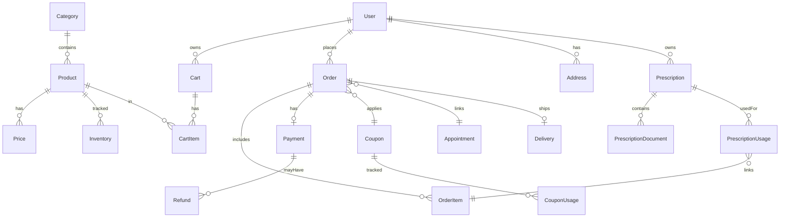

# Plan de Base de Datos — Módulo E-commerce (Farmacia Digital) MediCitas

Este documento define el diseño de datos, relaciones, restricciones e índices para implementar el módulo E-commerce en MediCitas, alineado con la arquitectura existente (Django + DRF) y el plan funcional previamente establecido, compartido entre la Web y la App móvil (misma API y cuentas/credenciales unificadas).

## 1. Principios de diseño
- Normalización y consistencia: separar catálogo, precios, inventario, carrito, órdenes, envíos y pagos.
- Integridad referencial: claves foráneas con on_delete apropiado; constraints y validaciones en DB y modelo.
- Auditoría y trazabilidad: campos de timestamp, estados y logs de movimiento de stock/pagos/recetas.
- Seguridad: no confiar en totales del cliente; calcular en servidor; control de acceso por roles (admin gestiona catálogo/precios, farmacéutico valida recetas).
- Extensibilidad: foco en productos farmacéuticos (con y sin receta), cupones; futuro: impuestos, variantes, multi-moneda; servicios médicos en fase posterior.
- Multi-cliente: la misma base de datos sirve a Web y App; se soporta carrito invitado a nivel cliente y fusión al iniciar sesión (no requiere tabla específica en BD).

## 2. Apps y tablas propuestas
Se propone crear una nueva app Django `ecommerce` en `backend/apps/ecommerce/` con las siguientes entidades:

### 2.1 Catálogo
| Tabla | Campos | Notas |
|---|---|---|
| Category | id (PK), name, slug (único), description, is_active, created_at, updated_at | Índice en slug |
| Product | id (PK), category_id (FK), name, slug (único), description, is_active, service_type (enum: consultation, exam, package, product), duration_min (nullable), base_price (Decimal), currency (char 3), sku (único, opcional), barcode (opc), prescription_required (bool), manufacturer (opc), expiration_date (opc), created_at, updated_at | Índices en slug, sku; validaciones de expiración |
| Price | id (PK), product_id (FK), amount (Decimal), currency (char 3), tax_rate (Decimal, opc), valid_from (date/time), valid_to (date/time, opc), is_active (bool) | Constraint: un precio activo por producto; ventana de vigencia |

Notas:
- Para servicios (consultas, exámenes), `service_type` define integración con appointments.
- `base_price` y `Price` coexisten: `Price` permite historial/reglas temporales.

### 2.2 Inventario (solo productos físicos)
| Tabla | Campos | Notas |
|---|---|---|
| Inventory | id (PK), product_id (FK), stock (int), reserved_stock (int), location (opc), min_stock (opc), updated_at | Constraint: stock >= 0, reserved_stock >= 0 |
| StockMovement | id (PK), product_id (FK), quantity (int, +in, -out), type (enum: in, out, reserve, unreserve, adjust), order_id (FK opc), reason (text opc), created_at, created_by (FK users) | Audita cambios de stock |

Reglas:
- Reservas de stock al crear carrito/checkout; confirmación de orden descuenta stock; cancelación libera reservas.

### 2.3 Carrito
| Tabla | Campos | Notas |
|---|---|---|
| Cart | id (PK), user_id (FK users), status (enum: active, ordered, abandoned), currency, total (Decimal calculado), coupon_id (FK opc), created_at, updated_at | Un carrito activo por usuario |
| CartItem | id (PK), cart_id (FK), product_id (FK), quantity (int), unit_price (Decimal), subtotal (Decimal calculado), created_at, updated_at | Constraint: quantity > 0; Unique(cart, product) |

Notas:
- Carrito invitado: se maneja en almacenamiento local del cliente (Web/App) y se fusiona con el carrito persistente al iniciar sesión.

### 2.4 Órdenes y pagos
| Tabla | Campos | Notas |
|---|---|---|
| Order | id (PK), user_id (FK), status (enum: pending, paid, failed, cancelled, refunded), total (Decimal), currency, coupon_id (FK opc), appointment_id (FK appointments opc), payment_intent_id (char), idempotency_key (char, único), delivery_mode (enum: pickup, delivery, virtual), shipping_address_id (FK opc), created_at, updated_at | Índices en status, created_at |
| OrderItem | id (PK), order_id (FK), product_id (FK), quantity (int), unit_price (Decimal), subtotal (Decimal), created_at | Copia de precio del momento |
| Payment | id (PK), order_id (FK único), status (enum: created, confirmed, failed, refunded), amount (Decimal), currency, gateway (enum: stripe, paypal, ...), transaction_id (char), receipt_url (opc), created_at, updated_at | Índice en transaction_id |
| Refund | id (PK), payment_id (FK), amount (Decimal), reason (text), status (enum: requested, processed, failed), created_at, processed_at | — |

Reglas:
- Totales e impuestos calculados en servidor al confirmar orden.
- `idempotency_key` para evitar cobros duplicados.

### 2.5 Cupones y promociones
| Tabla | Campos |
|---|---|
| Coupon | id (PK), code (único), discount_type (enum: percent, fixed), value (Decimal), max_uses (int), used_count (int), valid_from, valid_to, min_order_total (opc), is_active |
| CouponUsage | id (PK), coupon_id (FK), user_id (FK), order_id (FK), used_at |

Reglas:
- Validación de ventana de vigencia, límites por usuario, totales mínimos.

### 2.6 Envíos (si aplica a productos físicos)
| Tabla | Campos |
|---|---|
| Address | id (PK), user_id (FK), line1, line2, city, region, postal_code, country, phone, is_default |
| Delivery | id (PK), order_id (FK único), status (enum: pending, preparing, shipped, delivered, cancelled), provider (opc), tracking_code (opc), scheduled_date (opc), delivered_at |

### 2.7 Integración con citas (servicios)
- `Order.appointment_id` (FK a `appointments.models.Appointment`) para vincular órdenes con una cita.
- Para productos de `service_type` consulta/examen: post-pago crear/confirmar cita.

### 2.8 Recetas y verificación farmacéutica
| Tabla | Campos | Notas |
|---|---|---|
| Prescription | id (PK), user_id (FK), status (enum: submitted, approved, rejected, expired), doctor_name (opc), issued_at (opc), expires_at (opc), notes (opc), created_at, updated_at | Índices en status, user |
| PrescriptionDocument | id (PK), prescription_id (FK), file_url (o FileField), uploaded_at | Soporte de múltiples archivos |
| PrescriptionUsage | id (PK), prescription_id (FK), order_item_id (FK), used_at | Traza qué receta se usó en cada ítem |

Reglas:
- `Product.prescription_required = true` exige `Prescription.status = approved` asociada al `OrderItem` antes de que la orden avance a "preparing".
- Vencimiento: no se puede usar una receta expirada.
- Auditoría: toda acción de aprobación/rechazo se loguea con usuario responsable (rol farmacéutico).

## 3. Tipos, enums y validaciones
- Moneda: `currency` como `CharField(3)` con ISO 4217; usar `DecimalField(max_digits=12, decimal_places=2)`.
- Estados:
  - `Order.status`: pending, paid, failed, cancelled, refunded.
  - `Payment.status`: created, confirmed, failed, refunded.
  - `Delivery.status`: pending, preparing, shipped, delivered, cancelled.
  - `Cart.status`: active, ordered, abandoned.
  - `StockMovement.type`: in, out, reserve, unreserve, adjust.
- Constraints:
  - `UniqueConstraint(fields=['slug'])` en Category/Product.
  - `UniqueConstraint(fields=['product', 'is_active'], condition=is_active=True)` en Price (precio activo único por producto).
  - `UniqueConstraint(fields=['cart', 'product'])` en CartItem.
  - `CheckConstraint(quantity__gt=0)` en CartItem/OrderItem.
  - `CheckConstraint(stock__gte=0, reserved_stock__gte=0)` en Inventory.
  - `UniqueConstraint(fields=['idempotency_key'])` en Order.
  - Bloqueo de venta: validación a nivel de aplicación que impida confirmar órdenes con `OrderItem.product.prescription_required` sin `PrescriptionUsage` válido.

## 4. Índices recomendados
- `Product.slug`, `Product.sku`, `Product.is_active`, `Product.service_type`.
- `Order.status`, `Order.created_at`.
- `Payment.transaction_id`, `Coupon.code`.
- `StockMovement.product_id, created_at` compuesto para auditoría.
- `Prescription.status, Prescription.user_id` para consultas de validación.

## 5. Esquema ER (Mermaid)


## 6. Esqueleto de modelos Django (resumen)
> Fragmentos ilustrativos (no exhaustivos); se recomienda crear `backend/apps/ecommerce/models.py` y dividir por dominio si crece.

```python
# backend/apps/ecommerce/models.py
from django.db import models
from django.conf import settings
from django.utils import timezone

class Category(models.Model):
    name = models.CharField(max_length=120)
    slug = models.SlugField(unique=True)
    description = models.TextField(blank=True)
    is_active = models.BooleanField(default=True)
    created_at = models.DateTimeField(auto_now_add=True)
    updated_at = models.DateTimeField(auto_now=True)

class Product(models.Model):
    SERVICE_TYPES = (
        ("consultation", "Consulta"),
        ("exam", "Examen"),
        ("package", "Paquete"),
        ("product", "Producto"),
    )
    category = models.ForeignKey(Category, on_delete=models.PROTECT)
    name = models.CharField(max_length=200)
    slug = models.SlugField(unique=True)
    description = models.TextField(blank=True)
    is_active = models.BooleanField(default=True)
    service_type = models.CharField(max_length=20, choices=SERVICE_TYPES, default="product")
    duration_min = models.PositiveIntegerField(null=True, blank=True)
    base_price = models.DecimalField(max_digits=12, decimal_places=2)
    currency = models.CharField(max_length=3, default="USD")
    sku = models.CharField(max_length=64, blank=True, null=True, unique=True)
    barcode = models.CharField(max_length=64, blank=True, null=True)
    prescription_required = models.BooleanField(default=False)
    manufacturer = models.CharField(max_length=120, blank=True)
    expiration_date = models.DateField(null=True, blank=True)
    created_at = models.DateTimeField(auto_now_add=True)
    updated_at = models.DateTimeField(auto_now=True)

class Price(models.Model):
    product = models.ForeignKey(Product, on_delete=models.CASCADE)
    amount = models.DecimalField(max_digits=12, decimal_places=2)
    currency = models.CharField(max_length=3, default="USD")
    tax_rate = models.DecimalField(max_digits=5, decimal_places=2, null=True, blank=True)
    valid_from = models.DateTimeField(default=timezone.now)
    valid_to = models.DateTimeField(null=True, blank=True)
    is_active = models.BooleanField(default=True)

class Inventory(models.Model):
    product = models.ForeignKey(Product, on_delete=models.PROTECT, limit_choices_to={"service_type": "product"})
    stock = models.PositiveIntegerField(default=0)
    reserved_stock = models.PositiveIntegerField(default=0)
    location = models.CharField(max_length=120, blank=True)
    min_stock = models.PositiveIntegerField(default=0)
    updated_at = models.DateTimeField(auto_now=True)

class StockMovement(models.Model):
    TYPES = (
        ("in", "Ingreso"), ("out", "Salida"), ("reserve", "Reserva"), ("unreserve", "Liberar"), ("adjust", "Ajuste")
    )
    product = models.ForeignKey(Product, on_delete=models.PROTECT)
    quantity = models.IntegerField()  # puede ser negativo para salida
    type = models.CharField(max_length=20, choices=TYPES)
    order = models.ForeignKey("Order", on_delete=models.SET_NULL, null=True, blank=True)
    reason = models.TextField(blank=True)
    created_at = models.DateTimeField(auto_now_add=True)
    created_by = models.ForeignKey(settings.AUTH_USER_MODEL, on_delete=models.SET_NULL, null=True, blank=True)

class Cart(models.Model):
    STATUSES = (("active", "Activo"), ("ordered", "Ordenado"), ("abandoned", "Abandonado"))
    user = models.ForeignKey(settings.AUTH_USER_MODEL, on_delete=models.CASCADE)
    status = models.CharField(max_length=20, choices=STATUSES, default="active")
    currency = models.CharField(max_length=3, default="USD")
    coupon = models.ForeignKey("Coupon", on_delete=models.SET_NULL, null=True, blank=True)
    created_at = models.DateTimeField(auto_now_add=True)
    updated_at = models.DateTimeField(auto_now=True)

class CartItem(models.Model):
    cart = models.ForeignKey(Cart, on_delete=models.CASCADE, related_name="items")
    product = models.ForeignKey(Product, on_delete=models.PROTECT)
    quantity = models.PositiveIntegerField(default=1)
    unit_price = models.DecimalField(max_digits=12, decimal_places=2)
    subtotal = models.DecimalField(max_digits=12, decimal_places=2)
    created_at = models.DateTimeField(auto_now_add=True)
    updated_at = models.DateTimeField(auto_now=True)

class Order(models.Model):
    STATUSES = (
        ("pending", "Pendiente"), ("paid", "Pagada"), ("failed", "Fallida"), ("cancelled", "Cancelada"), ("refunded", "Reembolsada")
    )
    user = models.ForeignKey(settings.AUTH_USER_MODEL, on_delete=models.PROTECT)
    status = models.CharField(max_length=20, choices=STATUSES, default="pending")
    total = models.DecimalField(max_digits=12, decimal_places=2)
    currency = models.CharField(max_length=3, default="USD")
    coupon = models.ForeignKey("Coupon", on_delete=models.SET_NULL, null=True, blank=True)
    appointment = models.ForeignKey("appointments.Appointment", on_delete=models.SET_NULL, null=True, blank=True)
    payment_intent_id = models.CharField(max_length=120, blank=True)
    idempotency_key = models.CharField(max_length=120, unique=True)
    delivery_mode = models.CharField(max_length=20, default="virtual")
    shipping_address = models.ForeignKey("Address", on_delete=models.SET_NULL, null=True, blank=True)
    created_at = models.DateTimeField(auto_now_add=True)
    updated_at = models.DateTimeField(auto_now=True)

class OrderItem(models.Model):
    order = models.ForeignKey(Order, on_delete=models.CASCADE, related_name="items")
    product = models.ForeignKey(Product, on_delete=models.PROTECT)
    quantity = models.PositiveIntegerField()
    unit_price = models.DecimalField(max_digits=12, decimal_places=2)
    subtotal = models.DecimalField(max_digits=12, decimal_places=2)
    created_at = models.DateTimeField(auto_now_add=True)

class Payment(models.Model):
    STATUSES = (("created", "Creado"), ("confirmed", "Confirmado"), ("failed", "Fallido"), ("refunded", "Reembolsado"))
    order = models.OneToOneField(Order, on_delete=models.CASCADE, related_name="payment")
    status = models.CharField(max_length=20, choices=STATUSES, default="created")
    amount = models.DecimalField(max_digits=12, decimal_places=2)
    currency = models.CharField(max_length=3, default="USD")
    gateway = models.CharField(max_length=20, default="stripe")
    transaction_id = models.CharField(max_length=120, blank=True)
    receipt_url = models.URLField(blank=True)
    created_at = models.DateTimeField(auto_now_add=True)
    updated_at = models.DateTimeField(auto_now=True)

class Refund(models.Model):
    STATUSES = (("requested", "Solicitado"), ("processed", "Procesado"), ("failed", "Fallido"))
    payment = models.ForeignKey(Payment, on_delete=models.CASCADE)
    amount = models.DecimalField(max_digits=12, decimal_places=2)
    reason = models.TextField(blank=True)
    status = models.CharField(max_length=20, choices=STATUSES, default="requested")
    created_at = models.DateTimeField(auto_now_add=True)
    processed_at = models.DateTimeField(null=True, blank=True)

class Coupon(models.Model):
    TYPES = (("percent", "%"), ("fixed", "Fijo"))
    code = models.CharField(max_length=50, unique=True)
    discount_type = models.CharField(max_length=20, choices=TYPES)
    value = models.DecimalField(max_digits=12, decimal_places=2)
    max_uses = models.PositiveIntegerField(default=0)
    used_count = models.PositiveIntegerField(default=0)
    valid_from = models.DateTimeField()
    valid_to = models.DateTimeField()
    min_order_total = models.DecimalField(max_digits=12, decimal_places=2, null=True, blank=True)
    is_active = models.BooleanField(default=True)

class CouponUsage(models.Model):
    coupon = models.ForeignKey(Coupon, on_delete=models.CASCADE)
    user = models.ForeignKey(settings.AUTH_USER_MODEL, on_delete=models.CASCADE)
    order = models.ForeignKey(Order, on_delete=models.CASCADE)
    used_at = models.DateTimeField(auto_now_add=True)

class Address(models.Model):
    user = models.ForeignKey(settings.AUTH_USER_MODEL, on_delete=models.CASCADE)
    line1 = models.CharField(max_length=200)
    line2 = models.CharField(max_length=200, blank=True)
    city = models.CharField(max_length=120)
    region = models.CharField(max_length=120)
    postal_code = models.CharField(max_length=20)
    country = models.CharField(max_length=2, default="PE")
    phone = models.CharField(max_length=30, blank=True)
    is_default = models.BooleanField(default=False)

class Delivery(models.Model):
    STATUSES = (("pending", "Pendiente"), ("preparing", "Preparando"), ("shipped", "Enviado"), ("delivered", "Entregado"), ("cancelled", "Cancelado"))
    order = models.OneToOneField(Order, on_delete=models.CASCADE, related_name="delivery")
    status = models.CharField(max_length=20, choices=STATUSES, default="pending")
    provider = models.CharField(max_length=120, blank=True)
    tracking_code = models.CharField(max_length=120, blank=True)
    scheduled_date = models.DateTimeField(null=True, blank=True)
    delivered_at = models.DateTimeField(null=True, blank=True)

class Prescription(models.Model):
    STATUSES = (('submitted', 'Enviada'), ('approved', 'Aprobada'), ('rejected', 'Rechazada'), ('expired', 'Expirada'))
    user = models.ForeignKey(settings.AUTH_USER_MODEL, on_delete=models.CASCADE)
    status = models.CharField(max_length=20, choices=STATUSES, default='submitted')
    doctor_name = models.CharField(max_length=120, blank=True)
    issued_at = models.DateField(null=True, blank=True)
    expires_at = models.DateField(null=True, blank=True)
    notes = models.TextField(blank=True)
    created_at = models.DateTimeField(auto_now_add=True)
    updated_at = models.DateTimeField(auto_now=True)

class PrescriptionDocument(models.Model):
    prescription = models.ForeignKey(Prescription, on_delete=models.CASCADE, related_name='documents')
    file_url = models.URLField()  # o FileField con storage configurado
    uploaded_at = models.DateTimeField(auto_now_add=True)

class PrescriptionUsage(models.Model):
    prescription = models.ForeignKey(Prescription, on_delete=models.PROTECT)
    order_item = models.ForeignKey(OrderItem, on_delete=models.CASCADE, related_name='prescription_usages')
    used_at = models.DateTimeField(auto_now_add=True)
```

## 7. Reglas de negocio clave
- Cálculo de totales: `sum(order.items.subtotal)` + impuestos (si aplica) − descuentos; siempre en servidor.
- Stock: reservar al iniciar checkout; confirmar descuenta; cancelar libera.
- Cupones: validar ventana de tiempo, usos, totales mínimos y compatibilidad por producto/categoría (opcional).
- Idempotencia: `Order.idempotency_key` generado por cliente/servidor para evitar dobles cobros.
- Servicios médicos: si `Product.service_type != 'product'`, no se gestiona inventario; tras pago, crear/confirmar cita.
 - Recetas: productos con `prescription_required` deben tener una receta aprobada asociada a cada `OrderItem` antes de avanzar el flujo; trazabilidad completa.
 - Multi-cliente: al iniciar sesión se fusiona el carrito invitado (cliente) con el carrito persistente del usuario.

## 8. Migraciones y datos iniciales
- Crear migraciones por grupo (catálogo, inventario, carrito, órdenes/pagos, cupones, envíos).
- Cargar categorías y productos base; precios activos por defecto.
- Índices: agregar `models.Index` en campos críticos.
- Señales: actualizar `Inventory.reserved_stock` en eventos de checkout/cancelación.
 - Roles y permisos: crear grupos/roles para farmacéuticos con capacidad de aprobar/rechazar recetas.

## 9. Integración con apps existentes
- `users`: FK para user; permisos y roles ya definidos.
- `appointments`: FK opcional en Order; usar vistas/serializers existentes para crear/confirmar citas tras pago.
- `notifications`: disparar emails/notificaciones al status de Order/Delivery.
 - `users`: la misma cuenta y credenciales se usan en Web y App móvil; no se requiere tabla adicional.

## 10. Consideraciones futuras
- Variantes de producto (tamaños/presentaciones) con tabla `ProductVariant` y `VariantPrice`.
- Impuestos (IGV/IVA) por categoría/ubicación.
- Multi-moneda con conversión y tabla de tipos de cambio.
- Suscripciones/planes (pagos recurrentes).
 - Trazabilidad por lote/serie para medicamentos (tabla `BatchLot`) si se requiere normativa local.
 - Integración con verificación de recetas por proveedor externo.

Este plan de base de datos sirve como guía para implementar las migraciones y modelos del módulo E-commerce, garantizando integridad, seguridad y escalabilidad dentro del ecosistema MediCitas.